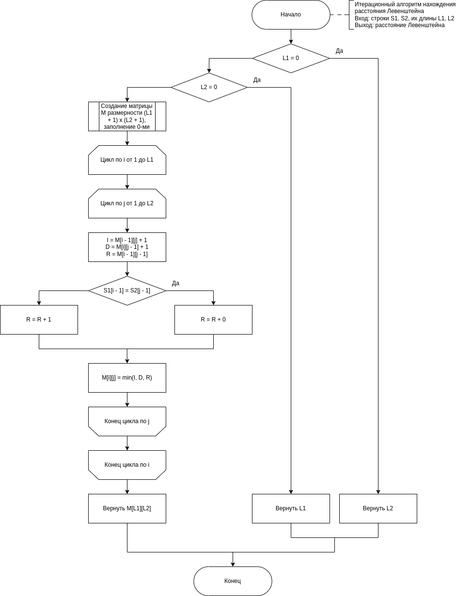

# ГОСТовские настройки для АА

## eskd-drawio.xml
Менее отвратительные блоки для Flowchart --- диаграм.


## modified-utf8gost705.bst
Нормальное оформление электронных источников.
Добавлены поля *etitle* и *accessed*, изменена логика *url*.

### etitle
Добавляет *[Электронный источник]* после указанного названия электронного ресурса.

### accessed
Добавляет *(дата обращения: ...*) для указанной даты.

### url
Меняет *URL* на *--- Режим доступа*.

## Пример добавления электронного источника в библиографию
```bib
% Neovim [Электронный ресурс]. — Режим доступа: https://neovim.io (дата обращения: 01.11.2023).
@misc{nvim,
	etitle = {Neovim},
	url    = {\url{https://neovim.io}},
    accessed = {01.11.2023},
}
```
